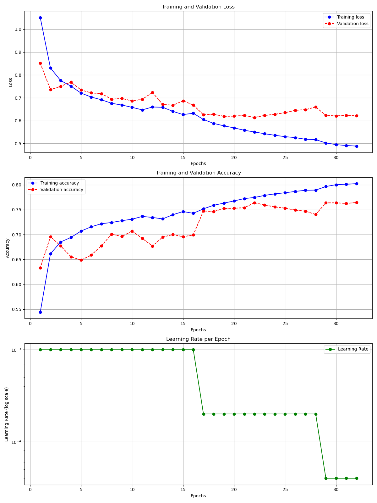

# 2025“泰迪杯”数据挖掘挑战赛数据挖掘B题

## 1. 项目概述

本项目使用 **融合传感器、Jerk及人口统计学特征的CNN-LSTM-Attention模型** 来预测 **基于MET值划分的活动类别** 分类问题。

竞赛地址：https://www.tipdm.org:10010/#/competition/1891311201049296896/question。

## 2. 文件结构说明

```shell
├── FitScaler/                     # 特征缩放/编码器相关
│   ├── FitScaler.py               # 训练和保存缩放/编码器的脚本
│   ├── age_encoder_all_100.pkl    # 已训练的年龄编码器
│   ├── scaler_jerk_all_100.pkl    # 已训练的Jerk特征缩放器
│   └── sex_encoder_all_100.pkl    # 已训练的性别编码器
├── Metadata/                      # 元数据处理
│   ├── metadata_test.py           # 测试集元数据信息
│   ├── metadata.py                # 训练集元数据的信息
│   ├── Metadata1.csv              # 元数据文件1
│   └── Metadata2.csv              # 元数据文件2
├── Prediction/                    # 模型预测与评估
│   └── Evaluate_CNN_LSTM.py       # 使用训练好的模型进行预测的脚本
├── PreProcess/                    # 数据预处理流程
│   ├── FirstProcess/              # 第一阶段预处理脚本存放处
│   │   ├── FirstProcess_Jerk.py   # 计算Jerk特征的脚本
│   │   └── FirstProcess_RemoveRedundant.py # 清洗和初步处理数据的脚本
│   ├── OriginalData/              # 存放原始数据 (P001-P00.csv 文件)
│   └── SecondProcess/             # 第二阶段预处理
├── ProcessedData/                 # 存放预处理后的数据
│   ├── ProcessedTestData/         # 处理后的测试数据
│   └── ProcessedTrainData/        # 处理后的训练数据 (FirstProcess 的最终输出)
├── Train_CNN_LSTM/                # 模型训练相关
│   └── CNN_LSTM_Jerk_Plot.py      # 训练CNN-LSTM模型并可能包含绘图功能的脚本
├── TrainedLog/                    # 训练日志和可视化结果
│   ├── train_log.txt              # 训练过程的文本日志
│   └── training_history_Attention_Jerk_ws...png # 训练历史的可视化图 (含Attention, Jerk特征)
├── TrainedModelPara/              # 存放训练好的模型参数
│   └── final_model_Attention_Jerk_ws...pth # 保存的最终模型文件 (含Attention, Jerk特征)
└── README.md                      # 项目说明文件 (即本文档)
```

## 3. 项目流程与逻辑

1. 数据加载与准备:
	- 从 `PreProcess/OriginalData/` 加载原始数据 `P001-P100.csv`。
	- 将Metadata.csv转换为使用 `Metadata/` 中的Python字典数据。
2. 数据预处理 - 第一阶段 (`PreProcess/FirstProcess/`):
   - `FirstProcess_RemoveRedundant.py`: 对原始数据进行初步清洗，包括：
     - 处理时间戳（排序、检查间隔、处理无效值）。
     - 插值填充 `x, y, z` 轴的缺失值。
     - 计算加速度幅值 `magnitude` $\sqrt{(x^2+y^2+z^2)}$。
     - 移除连续重复的 `x, y, z` 数据行。
     - 根据 `annotation` 列提取有效的 MET 值并过滤无效行。
     - 输出清洗后的数据（包含 `time`, `x`, `y`, `z`, `magnitude`, `annotation` 列），时间格式为 `HH:MM:SS.ffffff`。
   - `FirstProcess_Jerk.py`: 基于上一步的输出，计算 Jerk 特征：
     - 精确计算相邻时间点的时间差 Δ*t*。
     - 计算加速度变化率（Jerk）: $Jerk=Δacceleration/Δt$。
     - 将第一行的 Jerk 值设为 0。
     - 最终将包含 Jerk 特征 (`Jerk_x`, `Jerk_y`, `Jerk_z`) 的数据保存到 `ProcessedData/ProcessedTrainData/` 目录。
3. 数据预处理 - 第二阶段 (`PreProcess/SecondProcess/`):
   - 对测试数据P101-P120进行预处理，同第一阶段。
4. 特征缩放与编码 (`FitScaler/`):
   - 对训练数据进行特征缩放和编码，保存处理对象（`.pkl` 文件）。
5. 模型训练准备 (`Train_CNN_LSTM/CNN_LSTM_Jerk_Plot.py` 执行):
   - **数据划分**: 加载 `ProcessedData/ProcessedTrainData/` 中的所有 `P###.csv` 文件，并根据配置 (`VAL_FILES_COUNT`, `TEST_SET_SIZE`) 将文件列表随机划分为训练集、验证集和测试集。
   - **标签映射**: 将 'annotation' (MET 值) 映射为离散的类别标签 (0-4)。
   - 特征缩放与编码:
     - **加载训练数据**: 合并所有训练集文件到一个 DataFrame。
     - **拟合 Scaler**: 在合并后的训练数据上，对传感器特征 (`x`, `y`, `z`, `magnitude`, `Jerk_x`, `Jerk_y`, `Jerk_z`) 拟合 `StandardScaler`。
     - **拟合 Encoders**: 基于训练集参与者的元数据，拟合 `OneHotEncoder` 用于编码'sex' 和 'age_group' 特征。
     - *(注：此处拟合过程在训练脚本内部完成（但是没有保存为文件）。`FitScaler/` 目录下的脚本进行相关文件的保存*。
   - 数据集创建:
     - 使用自定义的 `IterableSensorDataset` 类处理数据。
     - 该类对数据应用滑动窗口（大小 `WINDOW_SIZE`，步长 `STEP`）生成序列。
     - 在生成每个序列时：
       - 应用已拟合的 `StandardScaler` 缩放传感器特征。
       - 获取对应参与者的'sex' 和 'age_group'，应用已拟合的 `OneHotEncoder` 进行编码。
       - 拼接缩放后的传感器特征和编码后的人口统计学特征，形成最终输入模型的序列。
       - 返回序列及其对应的类别标签（窗口末端的标签）。
   - **DataLoader 创建**: 为训练、验证和测试数据集创建 `DataLoader` 实例，用于按批次 (`BATCH_SIZE`) 加载数据。
   
   - 模型训练 (`Train_CNN_LSTM/CNN_LSTM_Jerk_Plot.py` 执行):
     - **模型构建**: 定义 `CNN_LSTM_Attention_Model` 模型，包含 CNN 层、双向 LSTM 层、Attention 机制和全连接分类层。输入特征维度为传感器特征数 + 人口统计学特征数。
     - **损失函数**: 使用 `CrossEntropyLoss`，可选择根据训练集类别分布计算类别权重以处理不平衡问题。
     - **优化器**: 使用 `AdamW` 优化器。
     - **学习率调度**: 使用 `ReduceLROnPlateau` 调度器，根据验证集准确率动态调整学习率。
     - 训练循环:
       - 按设定的周期数 (`NUM_EPOCHS`) 进行训练。
       - 每个周期内，在训练集上训练模型，并在验证集上评估性能。
       - 实施 **Early Stopping**：若验证集准确率在一定周期内 (`EARLY_STOPPING_PATIENCE`) 没有显著提升 (`MIN_DELTA`)，则提前终止训练。
       - 记录训练和验证过程中的损失、准确率以及学习率变化。
     - 结果保存:
       - 将训练过程（损失、准确率、学习率）绘制成图表，保存到 `TrainedLog/training_history_...png`。
       - 保存验证集上表现最优的模型的状态字典到 `TrainedModelPara/final_model_...pth`。
6. 模型推理与预测生成 (`Prediction/Evaluate_CNN_LSTM.py` 执行):
   - 加载:
     - 加载 `TrainedModelPara/` 中保存的最终模型权重 (`.pth`)。
     - 加载 `FitScaler/` 中保存的 `StandardScaler` 和 `OneHotEncoder` (`.pkl`)。
     - 加载 `Metadata/metadata_test.py` 中定义的测试参与者 (P101 - P120) 的元数据。
     - 加载 P101 - P120 的数据(`.csv` )。
   - 处理与推理:
     - 逐个处理测试参与者文件 (P101 - P120)。
     - 对大数据文件使用**分块 (chunking)** 读取。
     - 对每个数据块：
       - 应用加载的 `StandardScaler` 缩放传感器特征。
       - 使用加载的 `OneHotEncoder` 编码该参与者的元数据。
       - 拼接特征，确保维度与模型输入一致。
       - 应用滑动窗口生成序列。
       - 将序列批量送入加载的模型 (`model.eval()` 模式) 进行推理，获取预测类别。
     - 使用缓冲区处理跨数据块的窗口重叠问题。
   - 输出:
     - 将每个时间点（窗口末端）的预测结果 (`annotation_class`) 与原始时间戳、坐标 (`time`, `x`, `y`, `z`) 结合。
     - 为每个测试参与者生成一个 CSV 文件 (如 `P101.csv`)，包含预测结果，保存到 `PredictionOutput/` 目录。

4. 训练结果(loss/acc/lr)


